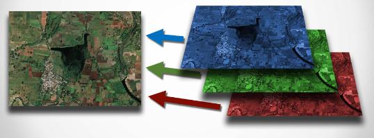
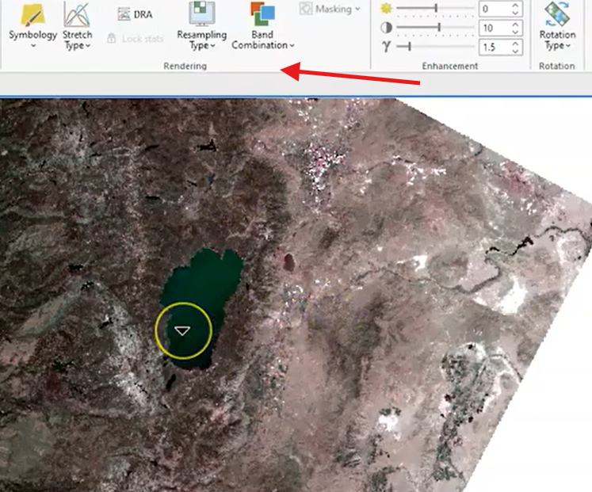

## Vector is Corrector.

Object data model:

- generalization
- represent real things as locations and attributes
- objects = conceptualizations of real items
- concrete or abstract

```json
{
    "type": "Feature",
    "geometry": {
        "type": "Point",
        "coordinates": [77.230004, 28.6947]
    },
    "properties": {
        "name": "Majnu ka Tilla",
        "type": "food joints",
        "rating": 4.5,
        "state": "Delhi",
        "country": "India"
    }
}
```

| Restaurant Name | Coordinates | Food Type | Cost (1-5) | Hours | Capacity | Rating |
|----------------|-------------|------------|------------|-------|----------|---------|
| Ama Restaurant | [77.2305, 28.6948] | Tibetan, Chinese | 2 | 11AM-10PM | 40 | 4.3 |
| Dolma House | [77.2307, 28.6945] | Tibetan | 2 | 10AM-9PM | 25 | 4.4 |
| AMA Cafe | [77.2306, 28.6947] | Cafe, Breakfast | 3 | 8AM-9PM | 30 | 4.6 |
| Rigo Restaurant | [77.2304, 28.6946] | Korean, Japanese | 3 | 12PM-10PM | 35 | 4.2 |
| Busan Korean | [77.2305, 28.6949] | Korean | 4 | 12PM-11PM | 45 | 4.5 |

> Rester is faster, but vector is corrector.

Vector caclculations:

- re-projection is precise
- reliably stores:
 - point overvations
 - edges
 - boundaries
- attributes stay reliable if joined properly

## Raster is Faster.

Raster data model:

[raster data model](assets/2025-01-28-05-48-17.png)

Raster alignment:

- location, grid of values
- raster become difficult when comparing locations (10m cell size vs 15m cell size)
- need to decide which cells should overlap

Raster re-projection:

- introduces errors
- lossy data
- less precise than vector

Multiband raster:

- rasters can be stacked to work with multiple rasters as if they're one.
- each "band" is a single raster.
- ex: represent data from different sensors captured at the same time.






## Geodatabase Data Types

**Summary Table of Concepts in Data Types and Management**

| **Concept**               | **Description**                                                                                                                                 | **Examples/Details**                                                                 | **Key Considerations**                                                                 |
|---------------------------|-------------------------------------------------------------------------------------------------------------------------------------------------|-------------------------------------------------------------------------------------|---------------------------------------------------------------------------------------|
| **Data Types (General)**  | Categories defining how data is stored, grouped, and processed. Determine valid operations and storage efficiency.                             | Numbers, text strings, dates/times.                                                 | Crucial for operations (e.g., math on numbers, not text). Affects tools, queries, and programming. |
| **Binary Interpretation** | Data is stored as binary (0s/1s). Interpretation depends on data type.                                                                          | Binary `1010100` = `84` (number) or `T` (text).                                     | Incorrect data type leads to misinterpretation (e.g., 84 vs. T).                      |
| **Integer Types**         | Whole numbers (no decimals). Subtypes vary by storage size and range.                                                                          | **Short Integer**: -32,768 to 32,767 (16 bits). **Long Integer**: ±2 billion (32 bits). | Use short integers for small ranges (e.g., 0-90° slope) to save space.                |
| **Decimal Types**         | Real numbers with decimal precision. Floating-point numbers allow variable decimal placement.                                                 | **Float (Single)**: ±10³⁸ (32 bits). **Double**: ±10³⁰⁸ (64 bits).                  | Use doubles for extreme precision/size. More storage and computational cost than integers. |
| **Text Strings**          | Stores text or numbers treated as text (non-mathematical).                                                                                     | ZIP codes, categories (e.g., "A1", "100-MainSt").                                   | ArcGIS file geodatabases lack length limits. Other systems may require length specs.  |
| **Null Values**           | Represents undefined/unknown data (distinct from zero).                                                                                        | Unpopulated fields, missing measurements.                                           | Math with nulls returns nulls (e.g., `5 + null = null`). Requires data cleanup.       |
| **Field Naming**          | Rules for naming fields to ensure clarity and compatibility.                                                                                   | Use `camelCase` or `underscores`; avoid spaces (e.g., `SlopeDegrees` or `slope_deg`). | Consistency and descriptiveness aid usability. Spaces may break database commands.    |

---

**Key Takeaways**:
- **Storage Efficiency**: Choose data types based on required range/precision (e.g., short vs. long integers).
- **Operations**: Data types enable/disallow operations (e.g., math on numbers, text concatenation).
- **Null Handling**: Nulls require special handling in calculations and analysis.
- **Naming Conventions**: Improve readability and system compatibility.

---

## Vector attribute datasets

import Tabs from '@theme/Tabs';
import TabItem from '@theme/TabItem';
import Mermaid from '@theme/Mermaid';

# Data Joins & Relational Concepts: Real-World Examples

---

## Core Concepts with Global Examples

### 1. **Primary & Foreign Keys**
**Concept**:  
- **Primary Key (PK)**: A unique identifier for records in a table (e.g., auto-generated IDs).  
- **Foreign Key (FK)**: A field in one table that references the primary key of another table.

**Real-World Example**:  
<Tabs>
<TabItem value="eiffel" label="Eiffel Tower Maintenance">

- **`Landmarks` Table** (Primary Key: `landmark_id`):  
  | landmark_id | name          | height_m |  
  |-------------|---------------|----------|  
  | 101         | Eiffel Tower  | 330      |  

- **`Maintenance_Logs` Table** (Foreign Key: `landmark_id`):  
  | log_id | landmark_id | date       |  
  |--------|-------------|------------|  
  | 201    | 101         | 2023-09-01 |  

<Mermaid value={`
erDiagram
    LANDMARKS ||--o{ MAINTENANCE_LOGS : "1-to-many"
    LANDMARKS {
        int landmark_id PK
        string name
        float height_m
    }
    MAINTENANCE_LOGS {
        int log_id PK
        int landmark_id FK
        date date
    }
`} />
</TabItem>

<TabItem value="yelp" label="Yelp Restaurant Reviews">

- **`Restaurants` Table** (PK: `restaurant_id`):  
  | restaurant_id | name               |  
  |---------------|--------------------|  
  | 301           | Central Park Café  |  

- **`Reviews` Table** (FK: `restaurant_id`):  
  | review_id | restaurant_id | rating |  
  |-----------|---------------|--------|  
  | 401       | 301           | 4.5    |  

**Why It Works**: Avoids duplicating restaurant details in every review.
</TabItem>
</Tabs>

---

### 2. **Types of Joins**
**Concept**: Linking tables based on shared attributes or location.  

<Tabs>
<TabItem value="table-join" label="Table Join Example (Disney World)">

**Scenario**: Linking ride locations to wait times.  
- **`Rides` Table** (PK: `ride_id`):  
  | ride_id | name           |  
  |---------|----------------|  
  | 501     | Space Mountain |  

- **`Wait_Times` Table** (FK: `ride_id`):  
  | time_id | ride_id | wait_minutes |  
  |---------|---------|--------------|  
  | 601     | 501     | 45           |  

<Mermaid value={`
erDiagram
    RIDES ||--o{ WAIT_TIMES : "1-to-many"
    RIDES {
        int ride_id PK
        string name
    }
    WAIT_TIMES {
        int time_id PK
        int ride_id FK
        int wait_minutes
    }
`} />
</TabItem>

<TabItem value="spatial-join" label="Spatial Join Example (Tokyo Subway)">

**Scenario**: Counting subway stations per neighborhood.  
- **`Subway_Stations`** (Points) ↔ **`Neighborhoods`** (Polygons).  

<Mermaid value={`
flowchart TD
    A[Subway Stations] -->|Spatial Join| B[Neighborhoods]
    B --> C{Count Stations}
    C --> D[Result: Shibuya → 12 stations]
`} />
</TabItem>
</Tabs>

---

### 3. **ArcGIS Relates vs. Joins**
**Concept**:  
- **Joins** merge attributes into one table (1:1 or 1:many).  
- **Relates** link tables dynamically without duplication (1:many, many:many).  

**Real-World Use Case**:  
**Great Barrier Reef Monitoring**  
- **`Reef_Polygons`** (1 record per reef) ↔ **`Coral_Health`** (multiple health scores per reef).  

| Reef_ID | Reef_Name      |  
|---------|----------------|  
| 701     | Agincourt Reef |  

| Health_ID | Reef_ID | Health_Score |  
|-----------|---------|--------------|  
| 801       | 701     | 8.5          |  

**Why Use a Relate?**  
Avoids duplicating reef geometry for each health score entry.

---

## 📊 Summary Table: Join Types & Use Cases

| Concept           | Example                                  | Global Use Case                     |  
|-------------------|------------------------------------------|-------------------------------------|  
| **Primary Key**   | `landmark_id` for Eiffel Tower           | Unique IDs for landmarks, users, products. |  
| **Foreign Key**   | `restaurant_id` in Yelp reviews          | Linking reviews to businesses.      |  
| **Spatial Join**  | Tokyo subway stations ↔ neighborhoods    | Urban planning, disaster response.  |  
| **Relate**        | Great Barrier Reef health data           | Environmental monitoring, research. |  

---

## Practical Exercise: Design a Tourism Database

**Scenario**: *Machu Picchu Visitor Management*  
**Task**: Design tables to track visitors, tickets, and archaeological sites.  

<Mermaid value={`
erDiagram
    ARCHAEOLOGICAL_SITES ||--o{ TICKETS : "1-to-many"
    TICKETS ||--o{ VISITORS : "many-to-many"
    ARCHAEOLOGICAL_SITES {
        int site_id PK
        string name
        geometry location
    }
    TICKETS {
        int ticket_id PK
        int site_id FK
        date visit_date
    }
    VISITORS {
        int visitor_id PK
        string name
        int ticket_id FK
    }
`} />