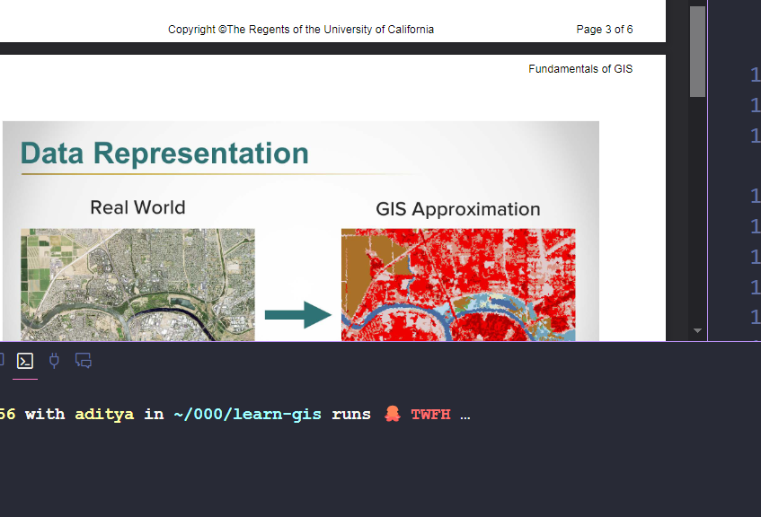

# GIS Data Types and Structures

# GIS Data Types and Structures

## Advantages and Disadvantages of Raster and Vector Data Models

| Feature                | Raster Data Model | Vector Data Model |
|------------------------|-------------------|-------------------|
| Precision in Graphics  | ❌ Lower precision   | ✅ Higher precision  |
| Traditional Cartography| ❌ Less suited       | ✅ Well suited       |
| Data Volume            | ❌ Larger            | ✅ Smaller           |
| Topology               | ❌ Not inherently supported | ✅ Inherently supported |
| Computation            | ✅ Faster for certain operations | ❌ Slower for certain operations |
| Update                 | ❌ More difficult    | ✅ Easier            |
| Continuous Space       | ✅ Well suited       | ❌ Less suited       |
| Integration            | ✅ Easier with remote sensing data | ❌ More complex |
| Discontinuous          | ❌ Less suited       | ✅ Well suited       |

## 1. Vector and Feature Data
- Categorical and multivariate data types
- Contains attribute tables with additional information:
    - Area measurements
    - Length of shapes
    - Geographic information (state, country)

### Vector Data Types
1. Points
     - Dimensionless
     - Represents single locations
2. Lines
     - One-dimensional
     - Contains attribute records
3. Polygons
     - Two-dimensional
     - Contains attribute records

## 2. Raster Data
- Used for continuous surfaces
- Similar to image-based data
- Characteristics:
    - Made up of fixed-size pixels
    - Each pixel contains area information
    - Contains various data types:
        - RGB imagery
        - Elevation data
        - Surface information
    - Attributes are per value, not per pixel

## 3. Spatial Data Containers
- File geodatabases
- SQLite/SpatiaLite databases
- GeoJSON
- PostGIS

### Shapefiles (ESRI Format)
- Industry standard format
- Contains multiple files (up to 37)
- Uses dBase4 for data tables
- Limitations:
    - Slower processing
    - Larger size
    - Being replaced by newer formats like GeoJSON

## 4. Map Documents
- Workspace for viewing and analyzing data
- Characteristics:
    - Stores data representation
    - Non-destructive editing
    - Enables geoprocessing
    - References data on disk
- Uses layers that:
    - Stack and overlay
    - Similar to image editing software layers
    - Represent geographic data