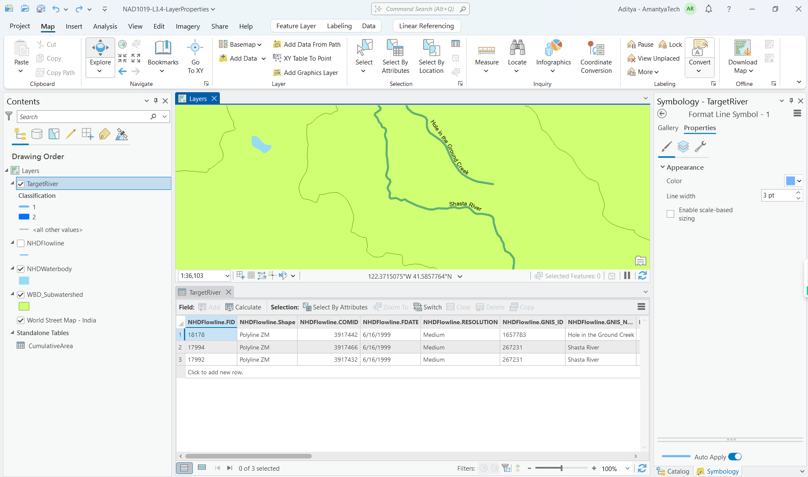

**Key Points:**
1. Attribute tables link data values to spatial features in GIS
2. Schema defines the structure and data types for attributes (it's just the table itself)
3. Records (rows) contain data about individual features 
4. Fields (columns) contain specific types of information 
5. Data types include text, integers, and decimal numbers
6. Null values are different from empty text values

```GeoJSON
  {
    "filed1": "row1",
    "field2": "row2"
  }
```

**Examples:**
1. Rivers data with attributes like:
  - Length in kilometers
  - GNIS name
  - Resolution
  - COMID
  - Classification (added field)

2. Strahler Stream Order Classification:
  - Order 1: Headwater streams (no incoming streams)
  - Order 2: Where two order 1 streams merge

**Key Steps Demonstrated:**
1. Adding a New Field:
  - Click "Add" in attribute table
  - Name the field
  - Select data type
  - Set field length
  - Save changes



2. Field Calculation:
  - Right-click field
  - Choose "Calculate Field"
  - Use Python 3 expression❗
  - Set value (e.g., classification = 1)


3. Interactive Selection:
  - Use selection tool
  - Click and drag to select features
  - Clear selections as needed


4. Symbology Based on Attributes:
  - Choose unique values renderer
  - Select classification field
  - Assign colors and line thickness
  - Apply to different values


**Common Tasks:**
1. Picking out specific data from big datasets
2. Adding new information to existing features
3. Grouping features based on their attributes
4. Showing data based on attribute values
5. Working with chosen features

**Example:**

Let's say you have a map of a city with different types of buildings. You can:

1. Select only the schools from the map.
2. Add information like the number of students to each school.
3. Group buildings into categories like residential, commercial, and educational.
4. Show only the schools on the map.
5. Work with the selected schools to analyze their locations.

Types of selections:

1. Interactive selection.
2. select by attributes.
  
  - input features: object that I wanna select
  - selecting features: objects that drive the selection
3. select by location
  - 