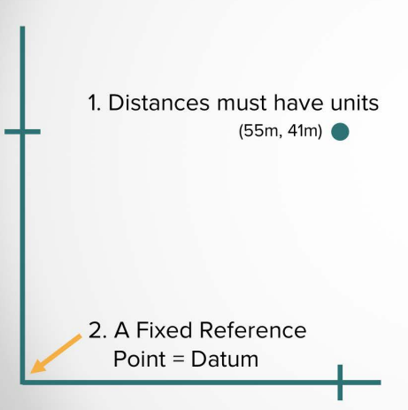
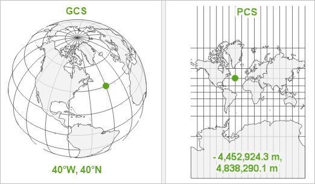
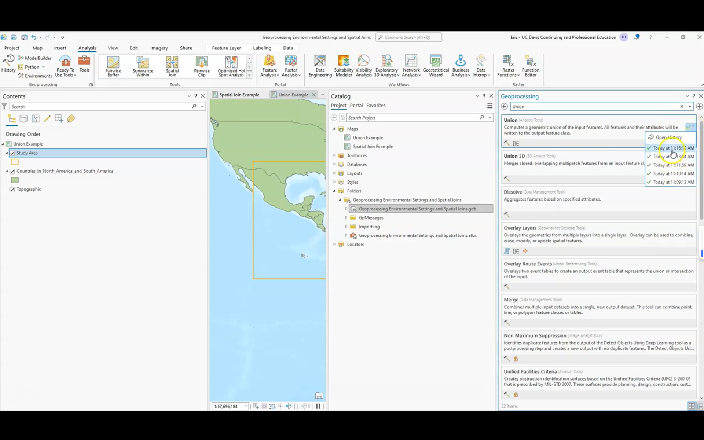
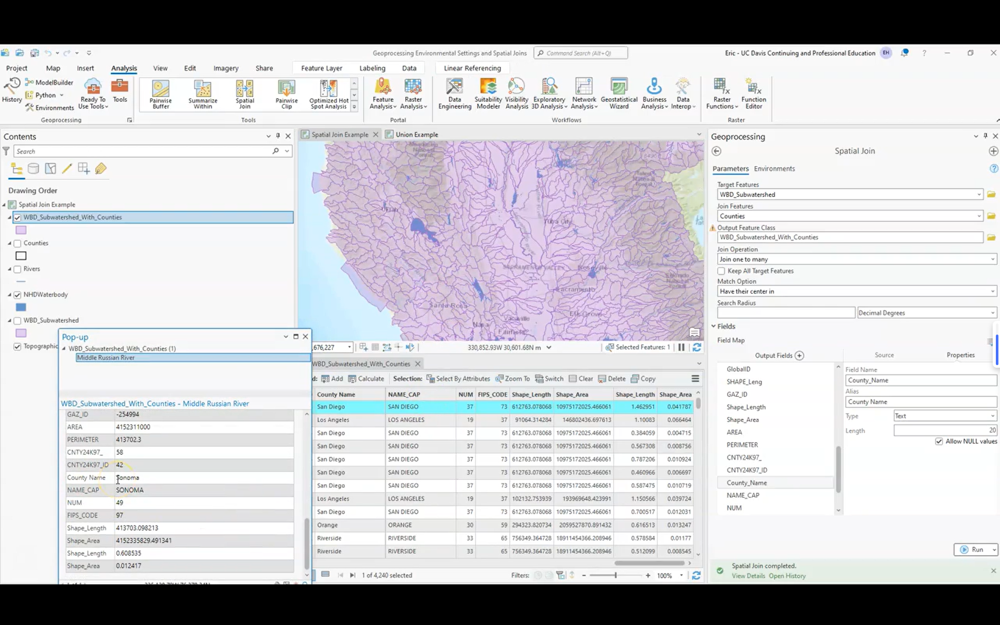

# Projections and geoprocessing

## key terms

- prime maridian: 0° longitude
- equator: 0° latitude
- datum: reference point for measuring locations on Earth
- projection: algorithm to convert 3D Earth to 2D map
- 

All projections have a coordinate system

!tl;dr
GCS is sphrere, PCS is flat map.

|  | Geographic Coordinate System | Projected Coordinate System |
|---|---| --- |
| Earth as  |  sphere 🌍 | flat map 🗺️ |
| Units  |  datum, angular unit of measure, & central meridian | cartisian coordinates, latitude of origin & central meridian |
| Measured in  |  angles (44deg ) | meters (22m, 33m) |

!important
take earth and squish it inot a flat map -> distortion

Properties that get distorted from 3D to 2D:
- shape
- area
- distance
- direction

Projection types:

- equirectangular (default in ArcGIS): equal, constant distances between parallels and meridians. 
- mercator: angles preserved, good navigation, optimized for calculation speed, standard for web mapping
- mollweide: relative areas preserved, shape distorted
- universal transverse mercator (UTM): 60 zones, each 6° wide, good for local mapping

How does Greenland appear in each of these projections?

- equirectangular: meridians converge at poles -> more stretched out at poles -> Greenland looks bigger than it is
- mercator: Greenland looks huge, as big as Africa.
- mollweide: Greenland looks normal, but Africa looks smaller than it is.

---

## Goal
Find all countries that overlap with a bounding box on a map of North and South America.

## Steps
1. Create a bounding box over target region
2. Use Analysis Tools to find overlapping countries
3. Run Union tool to combine features
4. Join attributes to get country data

Key points:
- Analysis tab contains geoprocessing tools
- Union tool combines features (like set theory)
- Can join attributes of features
- Environment settings control tool behavior
- Results show all countries intersecting the box

## Goal
Find which countries contain specific watersheds using spatial join analysis.

## Steps
1. Select watershed features as target
2. Perform spatial join with country boundaries
3. Define one-to-many relationship (watershed to countries)
4. Configure field mappings and rename attributes
5. Review results in attribute table

Key points:
- Spatial Join tool connects geographic features based on location
- One watershed can overlap multiple countries
- Field mapping allows customizing output attributes
- Attribute table shows final joined data
- Can rename fields for clarity (e.g., "Name" to "County")

---

[An introduction to Projections](/static/pdfs/An-Introduction-to-Projections.pdf)