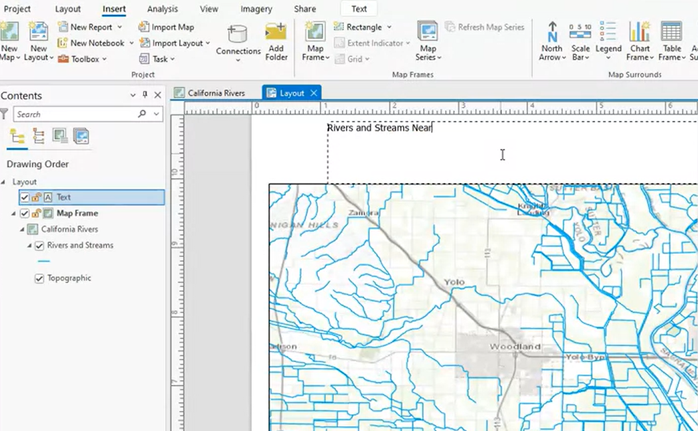
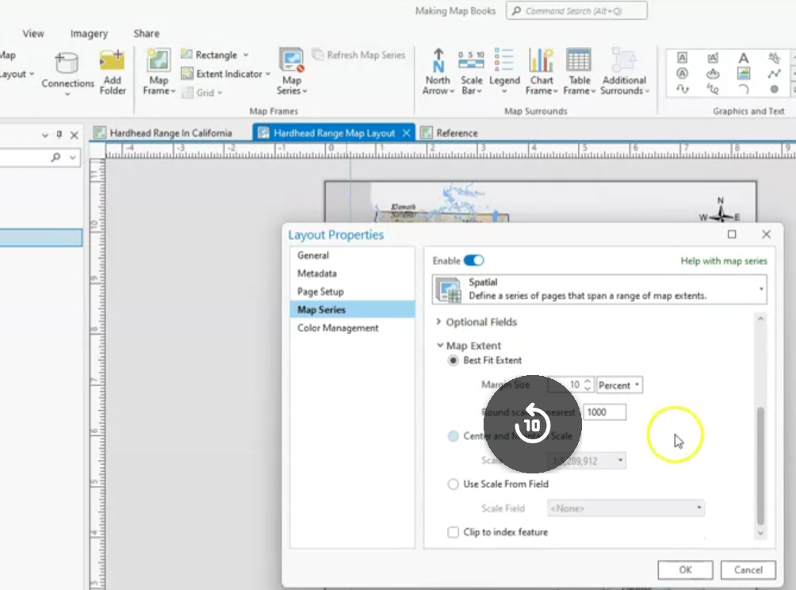

## Create a layout

Insert > New Layout > Add map > Save

> Can add legends scale and bars

assets/2025-01-23-08-29-10.png

## symbology ✝️

important design considerations:

- audience
- appropriate scale
- color

types of symbols:

- single
- categorical
- quantitative/continuous
- graphic or figure

Label the map so that the audience can understand the map.

## create map books 🗺️

By using map books it is easy to make a series of maps.

Insert > New Map Book > Add map > Save

common map elements:
- legends
- scale bars
- north arrows
- titles
- labels
