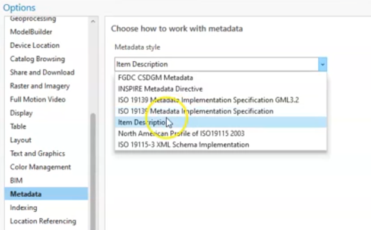
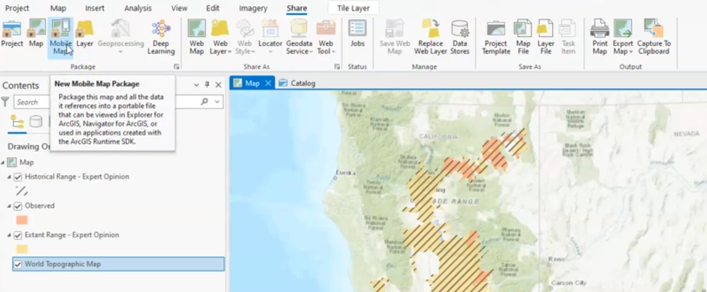
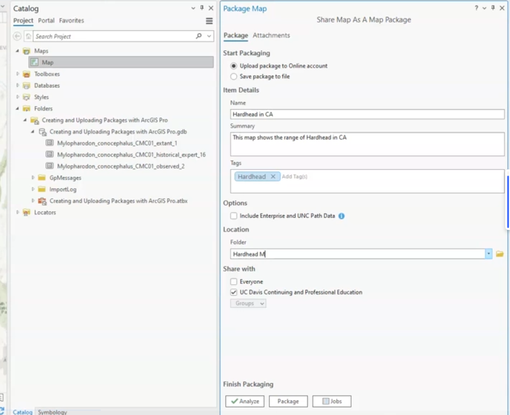
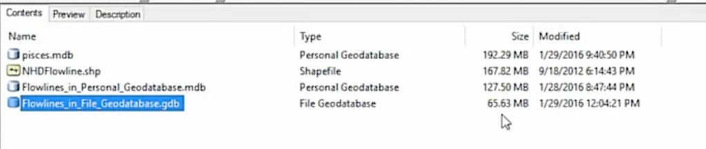

ESRI uses metadata from map services to provide information about the data.

share your data

package your map

## import map package 📦

assets/2025-01-26-15-41-43.png

## File and data formats  📁

- **Shapefiles**: Use for simple projects or when compatibility with other GIS software is required.
- **Personal Geodatabases**: Use for small to medium projects, especially when integration with Microsoft Access is needed.
- **File Geodatabases**: Use for large datasets, complex projects, and modern workflows due to their superior performance and flexibility.

| **Feature**                     | **Shapefile**                                                                 | **Personal Geodatabase**                                              | **File Geodatabase**                                                  |
|----------------------------------|-------------------------------------------------------------------------------|-----------------------------------------------------------------------|-----------------------------------------------------------------------|
| **File Format**                  | Multiple files (e.g., .SHP, .DBF, .PRJ, etc.)                                | Single file (.MDB)                                                    | Folder containing multiple files (managed by ArcGIS)                 |
| **Storage Technology**           | Old database technology                                                       | Based on Microsoft Access (old storage technology)                    | Modern storage technology                                            |
| **Data Types Supported**         | Vector only (points, lines, polygons)                                         | Vector, raster, tables, and Esri-specific data types                  | Vector, raster, tables, and Esri-specific data types                 |
| **Number of Feature Classes**    | Single feature class per shapefile                                            | Multiple feature classes                                              | Multiple feature classes                                             |
| **File Size Limit**              | 2GB per component file                                                        | 2GB for the entire database                                           | Virtually unlimited (limited by disk space)                         |
| **Field Name Limit**             | 13 characters                                                                 | 64 characters                                                         | 64 characters                                                        |
| **Compression**                  | No compression                                                                | Greater compression than shapefiles                                   | Highest compression among the three                                  |
| **Performance**                  | Slower for large datasets                                                     | Faster than shapefiles                                                | Fastest for large datasets                                           |
| **Compatibility**                | Widely supported across GIS software                                          | Compatible with Microsoft Access                                      | Requires ArcGIS or compatible software                               |
| **Ease of Sharing**              | Requires zipping multiple files                                               | Single file, easy to share                                            | Requires zipping the folder                                          |
| **Use Case**                     | Simple projects, widely supported format                                      | Small to medium projects, integration with Microsoft Access           | Large datasets, complex projects, modern workflows                   |
| **Metadata Support**             | Limited                                                                       | Better than shapefiles                                                | Best metadata support                                                |
| **Raster Data Support**          | Not supported                                                                 | Supported                                                             | Supported                                                            |
| **Editing and Querying**         | Limited                                                                       | Advanced (via Microsoft Access)                                       | Advanced (via ArcGIS)                                                |

## joins and relates

assets/2025-01-26-15-58-55.png

assets/2025-01-26-15-59-45.png

https://www.coursera.org/learn/gis/lecture/u0Axq/joins-and-relates

assets/2025-01-26-16-01-58.png

---

### Key Points:

1. **Joins and Relates in GIS**:
   - **Joins**: Combine tables by adding columns from one table to another based on a common ID column.
   - **Relates**: Establish a connection between two tables to pass selections or summarize information without physically merging the tables.

2. **Tables and Data Sources**:
   - Tables can be attribute tables associated with feature classes, independent tables (e.g., CSV files), or tables within a file geodatabase.
   - Joins and relates are used to connect different data sources for analysis or symbology in GIS.

3. **Common ID Column**:
   - Both joins and relies on a common ID column to link tables.
   - The ID column names do not need to be identical but must contain matching values.

4. **One-to-Many Relationships**:
   - Relates are particularly useful for one-to-many relationships, where one record in a table corresponds to multiple records in another table (e.g., one zone with multiple observations).

5. **Practical Applications**:
   - **Joins**: Useful for adding additional attributes to a feature class (e.g., adding drainage area data to rivers).
   - **Relates**: Useful for summarizing or analyzing related data (e.g., linking watersheds to species observations).

---

### Steps for Joins and Relates in ArcGIS Pro:

#### **Joins**:
1. **Identify Common ID**:
   - Ensure both tables have a common ID column with matching values.
2. **Add Join**:
   - Right-click the target layer (e.g., rivers) > **Joins and Relates** > **Add Join**.
   - Select the input table (e.g., cumulative area table) and the common ID column.
3. **Validate Join**:
   - Use the validate tool to check for one-to-one or one-to-many matches.
4. **Review Results**:
   - Open the attribute table to verify the joined columns.
   - Use **Select by Attributes** to check for unmatched records.

#### **Relates**:
1. **Identify Common ID**:
   - Identify the common ID column between the two tables (e.g., HUC 12 and Zone ID).
2. **Add Relate**:
   - Right-click the target layer (e.g., subwatersheds) > **Joins and Relates** > **Add Relate**.
   - Set the input and output fields, and define the relationship (e.g., one-to-many).
3. **Use Relate**:
   - Select features in the primary table (e.g., subwatersheds).
   - Use the **Related Data** option to view corresponding records in the related table (e.g., species observations).

---

### Exercises:

1. **Join Exercise**:
   - Load a feature class (e.g., rivers) and a CSV file with additional attributes (e.g., drainage area).
   - Perform a join to add the drainage area data to the rivers attribute table.
   - Validate the join and check for unmatched records.

2. **Relate Exercise**:
   - Load a feature class (e.g., watersheds) and a table with observations (e.g., species data).
   - Establish a relate between the watersheds and observations using a common ID.
   - Select watersheds and use the relate to view corresponding observations.

3. **Data Analysis**:
   - Use joined data to create symbology (e.g., color-code rivers by drainage area).
   - Use relates to summarize observations within selected watersheds.

4. **Error Checking**:
   - Practice identifying and resolving issues with joins and relates (e.g., mismatched IDs, null values).

---

### Summary:
- **Joins** physically combine tables by adding columns.
- **Relates** create a dynamic connection between tables for analysis.
- Both rely on a common ID column and are essential for managing and analyzing spatial and tabular data in GIS.