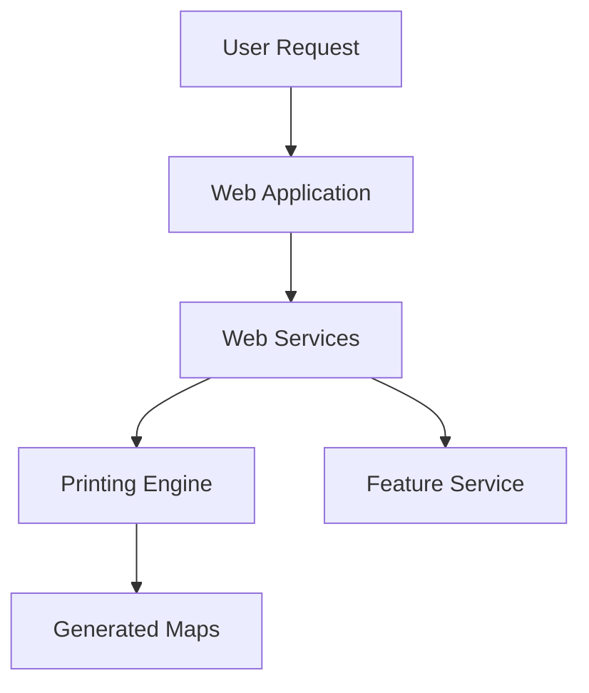

# Network Locator EU Documentation

This documentation is meant for the European version of Network Locator. The documentation for the North American version of Network Locator is found [here](#).

:::tip What is Network Locator?
Imagine you're a utility company that needs to share underground infrastructure information with construction companies. Network Locator is like having a smart assistant that helps you create precise, detailed maps showing where all your underground assets are located.
:::

## Real-World Use Case

Let's say a construction company is planning to dig for a new building foundation in Berlin. They need to know:
- Where are the gas lines?
- Are there any water mains?
- What about electrical cables?

Network Locator helps utility companies quickly generate accurate map documents showing all this critical information, preventing accidental damage to infrastructure and ensuring safety.

## Core Features

- **Smart Map Generation**: Create detailed infrastructure maps in just a few clicks
- **Automated Documentation**: Generate standardized reports that comply with EU regulations
- **Integration Ready**: Works seamlessly with existing GIS systems and databases
- **Multi-format Export**: Export maps in various formats (PDF, DWG, etc.)
- **Access Control**: Secure system ensuring only authorized personnel can access sensitive infrastructure data

## Getting Started

To set up Network Locator, you'll need to follow these main steps:

1. **Kubernetes Setup**: Ensure your infrastructure meets the requirements
2. **Deployment**: Install components like the printing engine and web services
3. **Configuration**: Set up access and customize settings for your organization

:::note
Detailed instructions for each step are available in their respective sections.
:::

## System Architecture

## References
- [Technical Requirements](./requirements)
- [Deployment Guide](./deployment)
- [Configuration Manual](./configuration)
